# SaaS College Management System (MONOREPO)

A robust, Multi-Tenant SaaS platform designed to streamline administrative and academic workflows for multiple educational institutions under a single ecosystem. Built with the MERN Stack, this project replaces fragmented systems with a unified, high-impact software solution featuring strict data isolation and predictive analytics.

Live URL -> [https://academia-erp.vercel.app](https://academia-erp.vercel.app)

## Features
- **Multi-Tenant Architecture:** Engineered with a custom "Tenant Interceptor" middleware to ensure 100% data isolation across independent institutions using a single database.
- **Granular RBAC:** Specialized access control for 5+ distinct roles including Admin, Manager, Principal, Teacher, and Student.
- **High-Velocity Onboarding:** "ticBased" creation engine using bulk operations (`insertMany`) to onboard entire semesters and student cohorts in seconds.
- **Student Productivity Engine:** An integrated K-Means clustering service that categorizes students into performance cohorts based on real-time academic metrics.
- **Optimized Data Structures:** Uses fixed-size nested arrays and MongoDB positional operators (`$set`) for high-frequency updates like attendance and bi-weekly reports without database bloat.

---

## Tech Stack

| Category | Technology |
| :--- | :--- |
| **Runtime** | Node.js |
| **Framework** | Express.js |
| **Frontend** | React, Redux Toolkit (RTK), Tailwind CSS |
| **Database** | MongoDB (Mongoose ODM) |
| **Auth** | JWT (Tenant-Aware) & BcryptJS |
| **Validation** | Joi |
| **Analytics** | Custom K-Means Implementation |

---

## Deep Dive into Features

### 1. Multi-Tenant Schema & Hierarchy based access control
The system functions via a "Gatekeeper" logic. Every request is processed through a Tenant Interceptor middleware that extracts the `collegeId` from the JWT.
* **Strict Isolation:** Automatically injects the `collegeId` into every Mongoose query, preventing any possibility of data leakage between different schools.
* **Identity Mapping:** Centralized Auth system manages different permission levels, ensuring a Principal from "College A" can never access data from "College B."
* **RBAC Hierarchy:** The system supports a 4-tier role based access control:
  1. **Super Admin:** Full system control, billing, and tenant creation.
  2. **Manager:** Can manage multiple colleges but cannot create new colleges.
  3. **Principal:** Can manage a single college and its staff/students.
  4. **Teacher:** Limited access to academic records.

  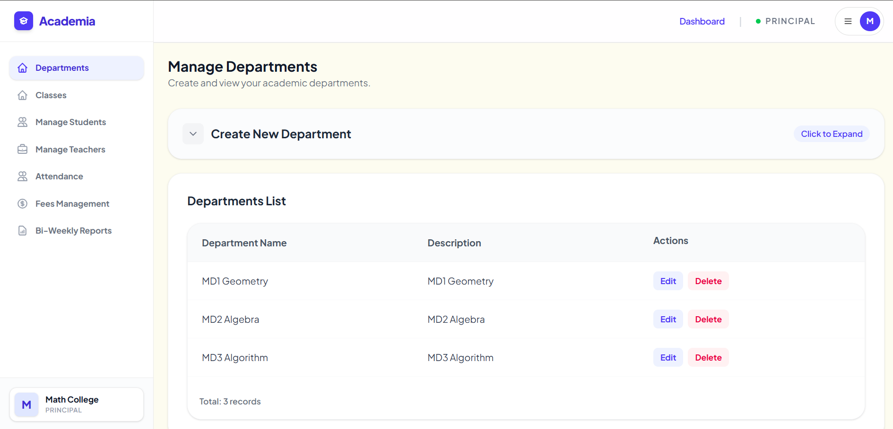
  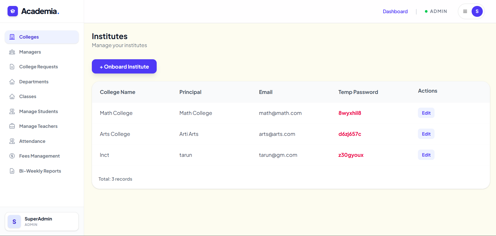

### 2. High-Frequency Operational Logic and Student Productivity logic
A bi-weekly analytical service that moves beyond simple grade-tracking to understand student behavior patterns.
To maintain high performance under heavy load, the system utilizes specialized data structures for daily operations.

* **Efficient Storage:** Instead of creating new documents daily, attendance is managed via a 91x4 nested array (13 weeks x 4 periods), significantly reducing document overhead.
* **Clustering Logic:** Runs a algorithm to group students into three performance cohorts: *Top Performing Students*, *Consistent Performers*, and *Students Needing Immediate Attention*. This allows administrators to track "Cluster Movement" and intervene before a student's performance drops significantly.
* **Teacher Performance:** Every update to a student's record increments a `workCount` on the Teacher model, creating a built-in metric for staff engagement and accountability. (building).

  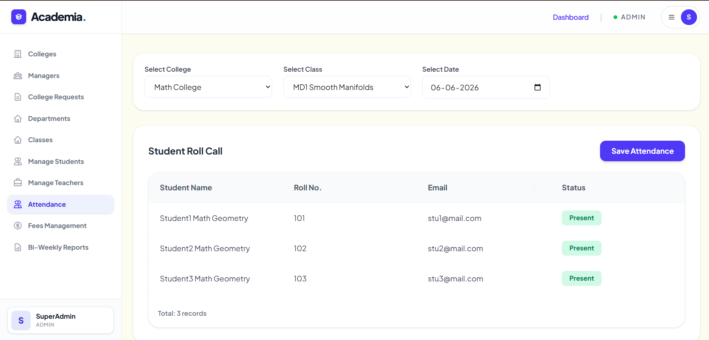
  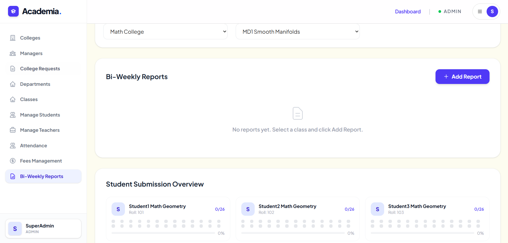

### 3. Fees Management
global fees management setup for full class that set automatically for each students also on adding new student this same fees get auto setup to the new added student, also managing Transaction History on every fee pay or concession. 

  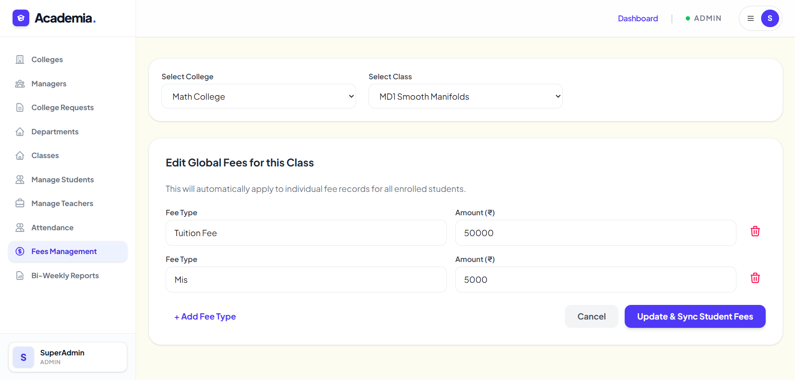
  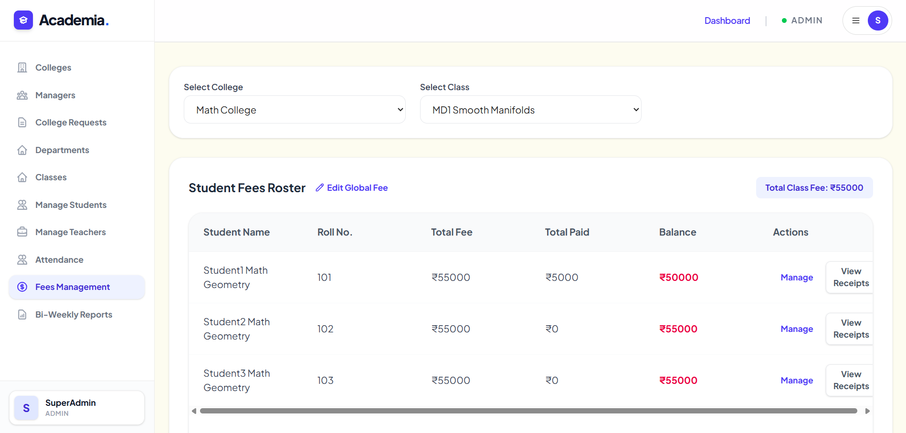
  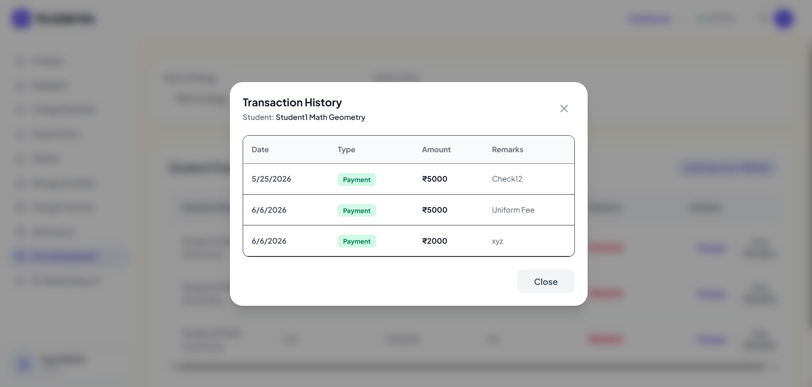

### 4. Smooth Onboardin flow
On The portfolio Page there is a form on which college can request with just few details, this data goes to the admin who then decide to create college and principle in just one click. and then it give a principle email and password who can login and use the CMS now. Important thing is if in case there are 100+ (not manageble count of college by a single admin) admin can create manager and assign colleges to the manager for next flo  w. full smooth flow with clean minimal UI/UX.

  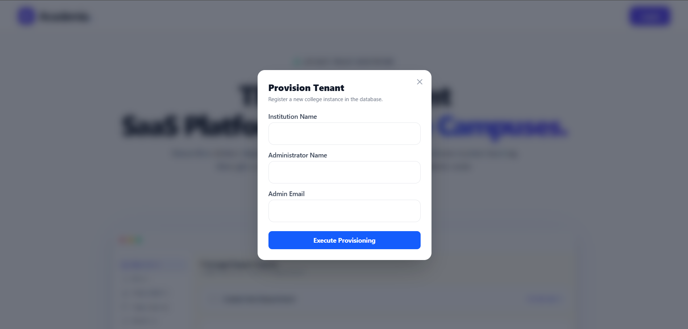
  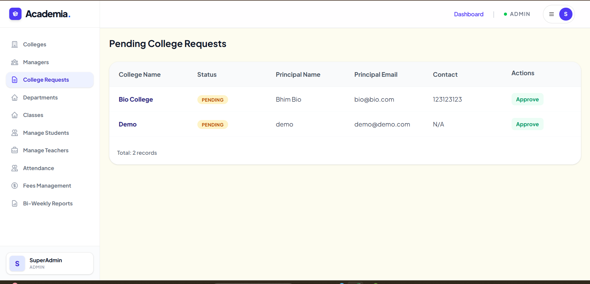
  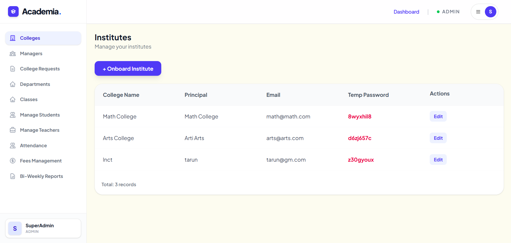
  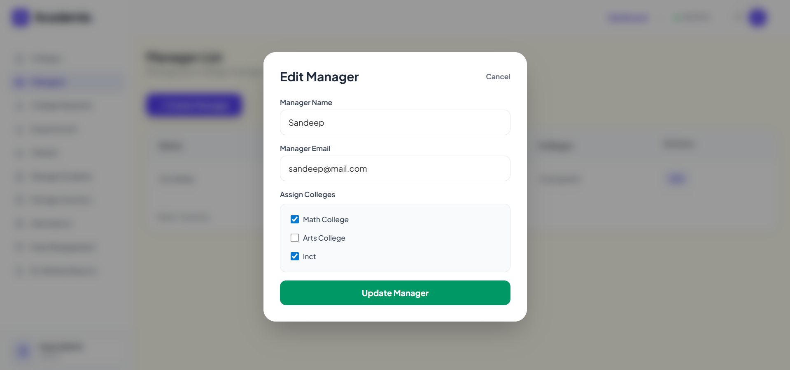
  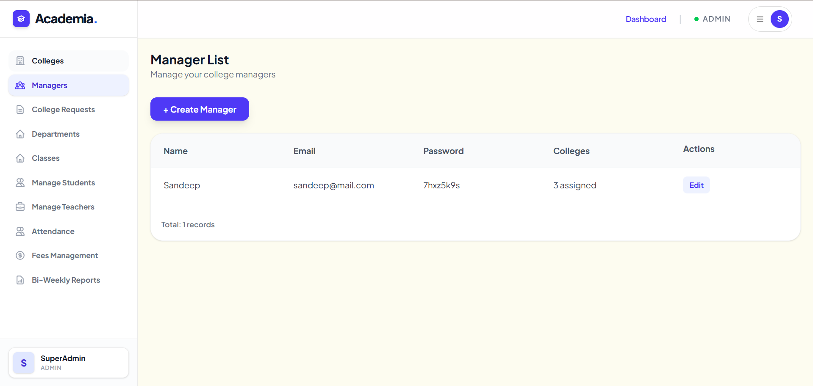

---

@fd
**Developed by Parmendra (Paras) Pawar** *Pre-final year B-Tech (AI & ML) | Ex-SDE Intern | NCC Cadet*
